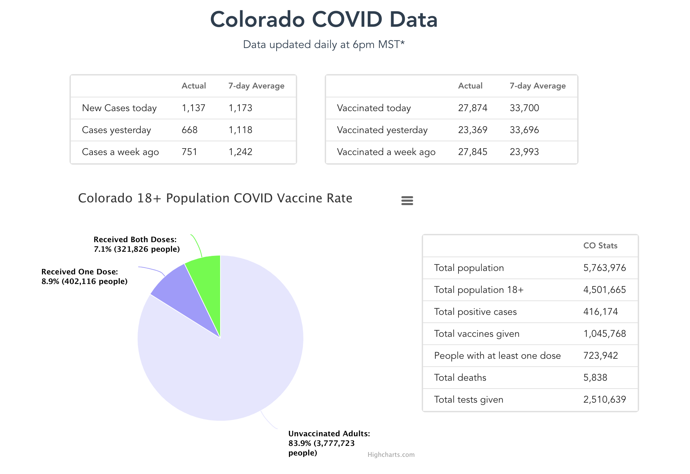

# Colorado COVID Data

### Colorado COVID data updated daily, including vaccine stats, daily infections, hospitalizations, and deaths due to COVID.


<br>
<details open="open">
  <summary><h2 style="display: inline-block">Table of Contents</h2></summary>
  <ol>
    <li>
      <a href="#about-the-project">About The Project</a>
      <ul>
        <li><a href="#built-with">Built With</a></li>
      </ul>
    </li>
    <li>
      <a href="#getting-started">Getting Started</a>
      <ul>
        <li><a href="#prerequisites">Prerequisites</a></li>
        <li><a href="#installation">Installation</a></li>
      </ul>
    </li>
    <li><a href="#how-it-works">How it works</a></li>
    <li><a href="#roadmap">Roadmap</a></li>
    <li><a href="#license">License</a></li>
    <li><a href="#contact">Contact</a></li>
  </ol>
</details>


<!-- ABOUT THE PROJECT -->
## About The Project

[](https://coloradocoviddata.com)

When I was looking around the web for Colorado COVID data the [Colorado government website](https://covid19.colorado.gov/data) had some good data and charts, but they were in a cluttered website with lots of data I wasn't interested in. This project delivers a simple layout of the data I wanted to see and updates the data daily automatically as soon as it's available. 

This repo is for the API and for fetching data. The front end repo can be found [here](https://github.com/jpclark6/colorado-covid-frontend)


### Built With

* [AWS SAM](https://aws.amazon.com/serverless/sam/)
* [AWS Lambda](https://aws.amazon.com/lambda/)
* [Python](https://www.python.org/)


## Getting Started

To get a copy up and running follow these simple steps.

### Prerequisites

 This project assumes you have an empty Postgres database handy. You will also need the AWS SAM CLI installed, and an AWS account.

```sh
$ ./scripts/setup.sh
```

You will also need to have some parameters saved to AWS SSM Parameter Store. Specifically:

* Database credentials `/colorado-covid/database`
* Key to invalidate the cache `/colorado-covid/invalidate_cache_key`
* URL of this project, used to invalidate the cache `/colorado-covid/api_url`

### Installation

1. Clone the repo to your favorite directory.
    ```sh
    $ git clone https://github.com/jpclark6/colorado-covid-tracker.git
    $ cd colorado-covid-tracker
    ```

2. Visit the Google Drive with the [vaccine data](https://drive.google.com/drive/folders/1r095ofG8YvNj_dMWEq4XKkfhDaF8-I0n) and download the latest version. Save it in the `./scripts/data_files` directory.

3. Run the migration and backfill script which will make the required migrations in your database, and then backfill the vaccine data table with the file you downloaded. The case data will be backfilled once the Lambda function runs for the first time.

4. Build and deploy the package
    ```sh
    $ sam build
    $ sam deploy --guided
    ```

### Running tests locally

1. Install the requirements
    ```sh
    $ pip install -r tests/requirements.txt -r src/etl/requirements.txt -r src/api/requirements.txt
    ```

2. Run the tests
    ```sh
    pytest
    ```


## How it works

When you deploy the package it creates the required resources to run this project. It creates two lambda functions which each download either case or vaccine data first in the raw form, then it saves it to S3, cleans the data and saves it to S3, and then loads the data into the Postgres DB for the API to use. Data is updated around 6PM MST but it changes daily. This checks every 10 minutes for new data from 4PM to 8PM daily. Once it finds new data it updates the DB and then invalidates the cached data in Lambda using a webhook.

The API uses a lambda function with API Gateway. Since the data is valid for 24 hours the lambda function can cache the data and then invalidate it when needed. This allows nearly limitless capacity with even the smallest  databases. Data is automatically invalidated after 15 minutes, or when the endpoint to invalidate the data is hit with the correct API key.


## Roadmap

1. Add logging to SAM template
1. After new data comes out stop requesting data for the rest of the day

## License

Distributed under the MIT License.


## Contact

[LinkedIn](https://linkedin.com/in/jpclark6)

